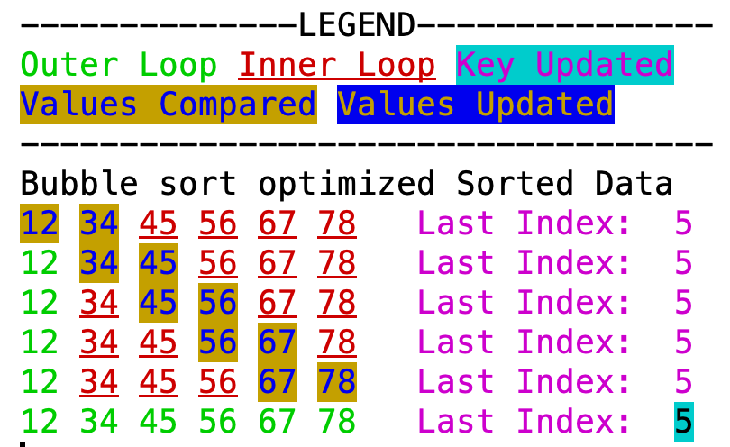
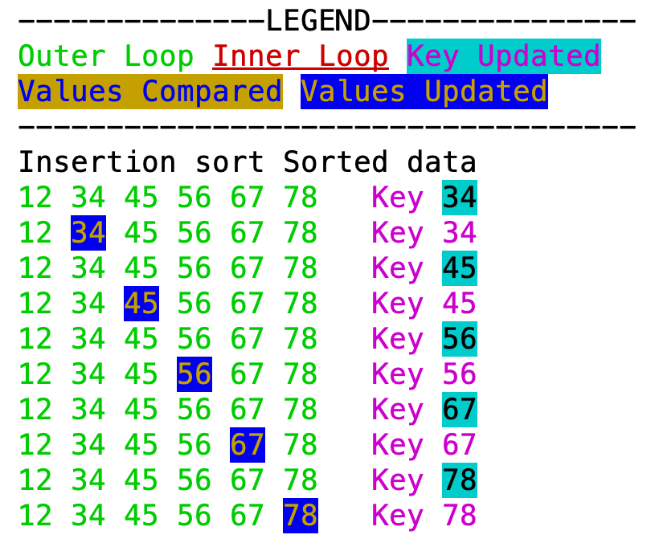
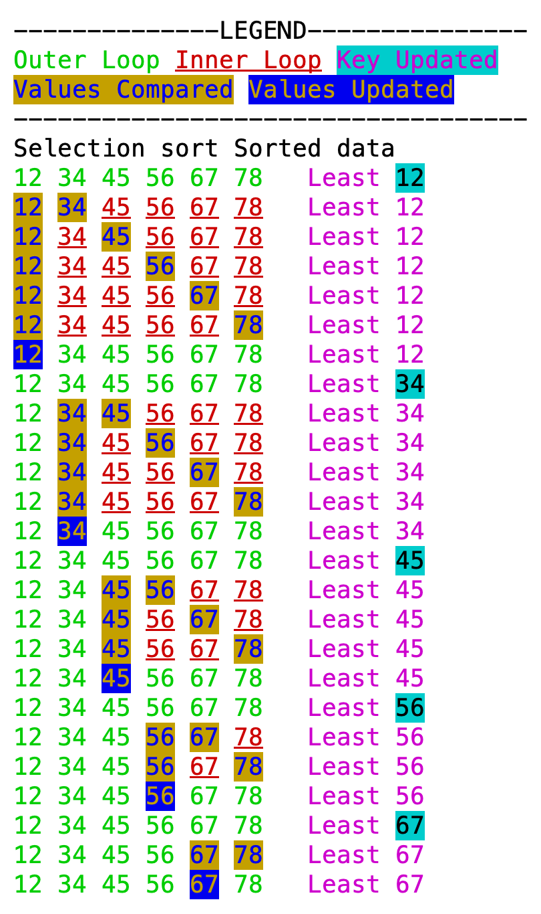

# SortingVisualized
Sorting algorithms implemented in Java with fancy print method, for better illustration. Following algorithms are implemented:

- Bubble sort optimized
- Insertion sort
- Selection sort

Animation can be turned on and off and animation speed can be adjusted by uncommenting following lines, in main method:

```
showAnimation = true;
delay= 2000;
```

Following are the gif's and snapshot of output, with animation turned on and off:
  
<table>
<thead>
  <tr>
    <th> Bubble Sort </th>
    <th> Insertion Sort </th>
    <th> Selection Sort </th>
  </tr>
</thead>
<tbody>
  <tr>
    <td colspan="3" align="center">Animated output for Randomized input</td>
  </tr>
  <tr>
    <td></img></td>
    <td></img></td>
    <td></img></td>
  </tr>
  <tr>
    <td colspan="3" align="center">Non animated ouput for Sorted input</td>
  </tr>
  <tr>
    <td valign="top"></img></td>
    <td valign="top"></img></td>
    <td valign="top"></img></td>
  </tr>
</tbody>
</table>
